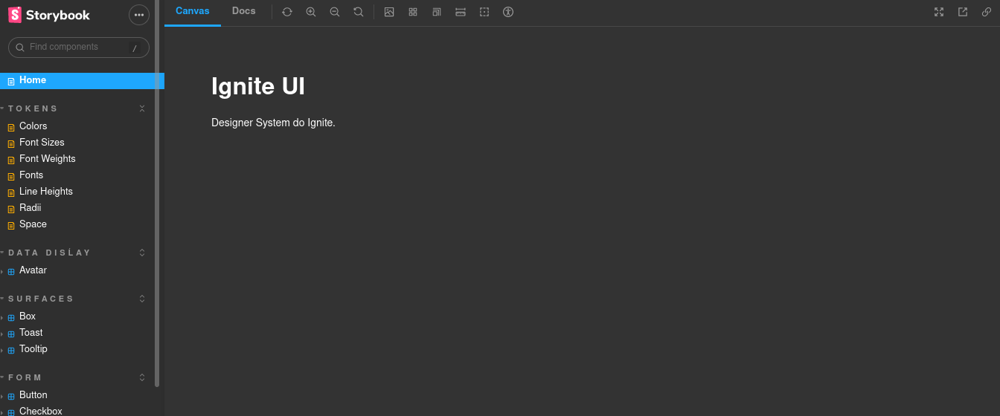
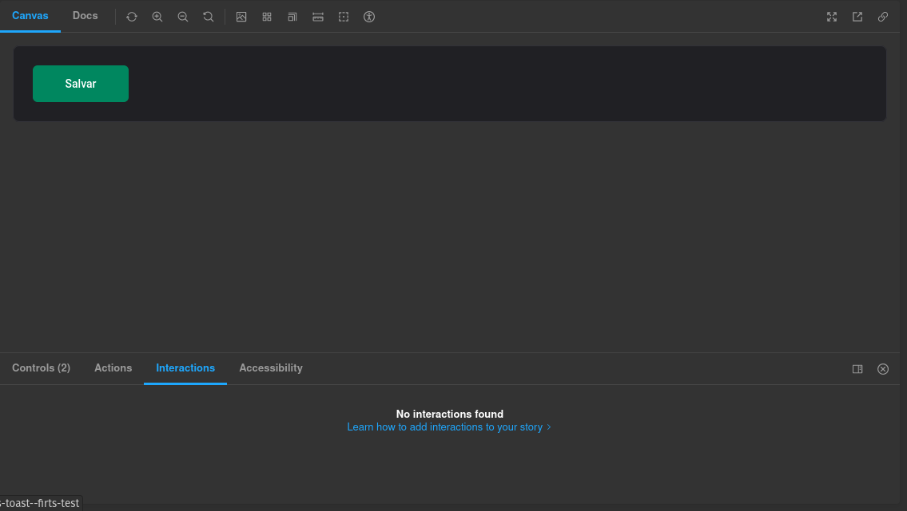

    

<h1 align="center" >Ignite Design System</h1>

 

    

      
    

        

      
    

  

<h3>Funcionalidades</h3>

Nesse módulo ignite Design System, desenvolver uma documentação dos componentes React com a ferramentas como Story Book. Com intuito de criar documentação agnóstica de framework.
O Storybook é um workshop de front-end para criar componentes e páginas de interface do usuário isoladamente. Milhares de equipes o usam para desenvolvimento, teste e documentação de interface do usuário. 

##  Tecnologias

  * __ReactJs__+__Typescript__
  * __Stitches__ para estilização
  * __Phosphor-React__ para ícones
  * __Radix-UI__ Dialog
  * __Storybook__ para documentação 
  * __Turbo repo__ para executar comandos de build e cachear 

  Feito com 💜 by <a href="https://www.linkedin.com/in/francinilton-soares-menezes-b905a422b//" >Francinilton</a>

